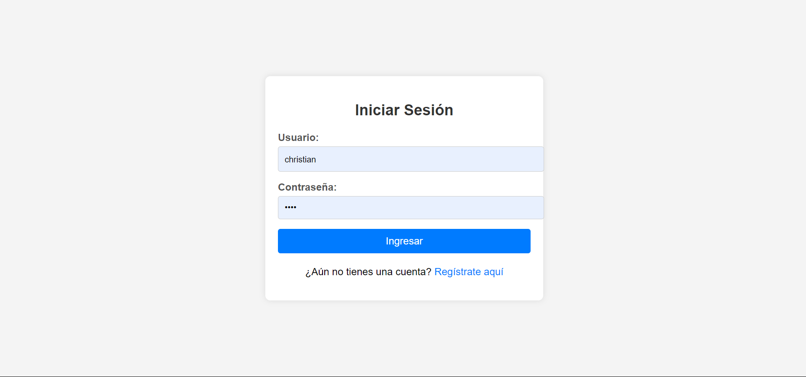
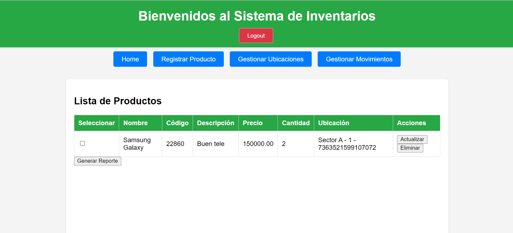
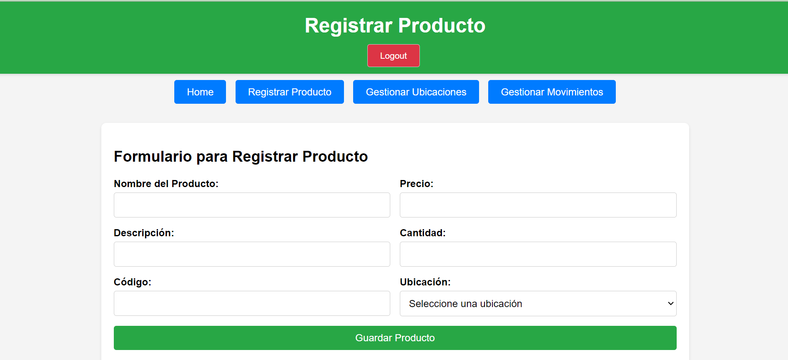
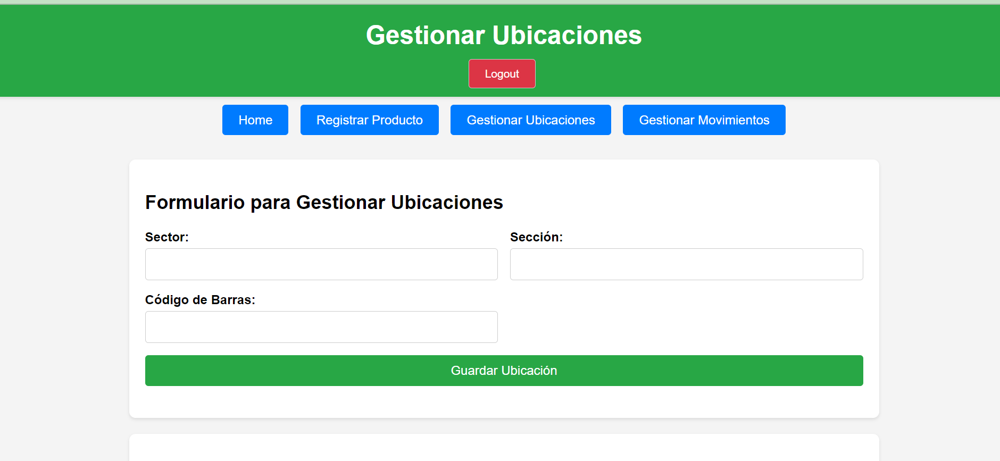
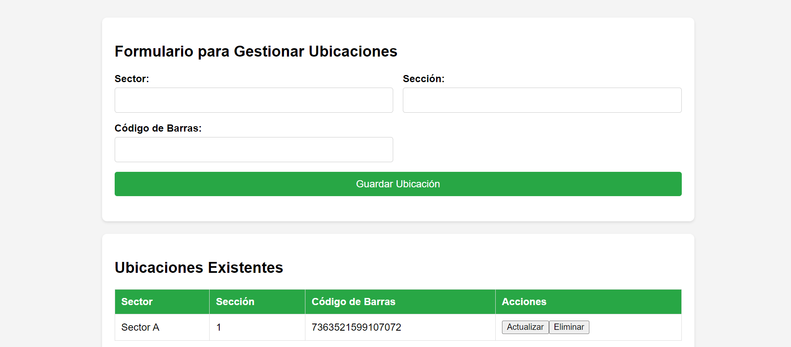
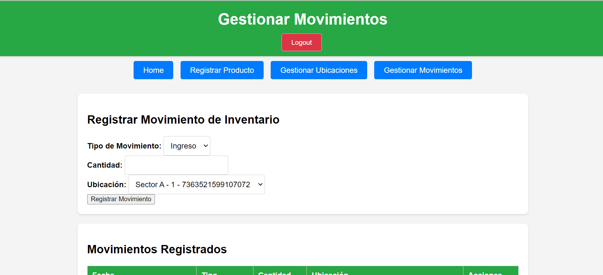
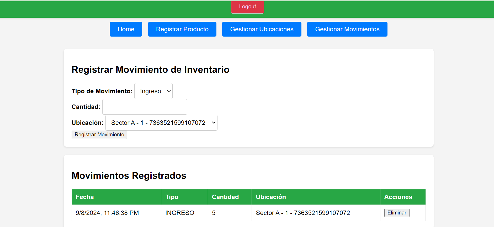

# Sistema de Inventarios
Sistema de inventarios construido con Spring Boot para el backend y HTML, CSS, y JavaScript para el frontend.

## Requisitos

- **Java 17**: Asegúrate de tener instalado Java 17 en tu sistema.
- **Gradle**: El proyecto usa Gradle para la gestión de dependencias. 
- **XAMPP**:  la gestión de la base de datos.

## Instrucciones para la Compilación y Ejecución

### 1. Configurar el Proyecto en Spring Boot

1. Clona este repositorio en tu máquina local.
2. Abre el proyecto en tu IDE (En mi caso VS CODE)
3. Sincroniza el proyecto con Gradle.

### 2. Configurar el Servidor MySQL

2. Crea una base de datos llamada `inventario` en MySQL.

### 3. Restaurar la Base de Datos

1. En la carpeta `BDSQL`, encontrarás un archivo llamado `inventario.sql`.
2. Restaura la base de datos utilizando este archivo. 
3. Alternativamente, puedes ejecutar el script SQL incluido en este README para crear las tablas necesarias sin registros iniciales.

### 4. Configurar el Puerto del Proyecto

- El proyecto está configurado para ejecutarse en el puerto `8081`. Frontend: `http://localhost:8081/index.html`.
- El puerto `3306` esté en uso para la base de datos MySQL.

### 6. Acceso al Sistema

- El sistema requiere que los usuarios estén registrados para poder acceder.

- Si tienes un cortafuegos activo, podrías necesitar desactivarlo temporalmente.

